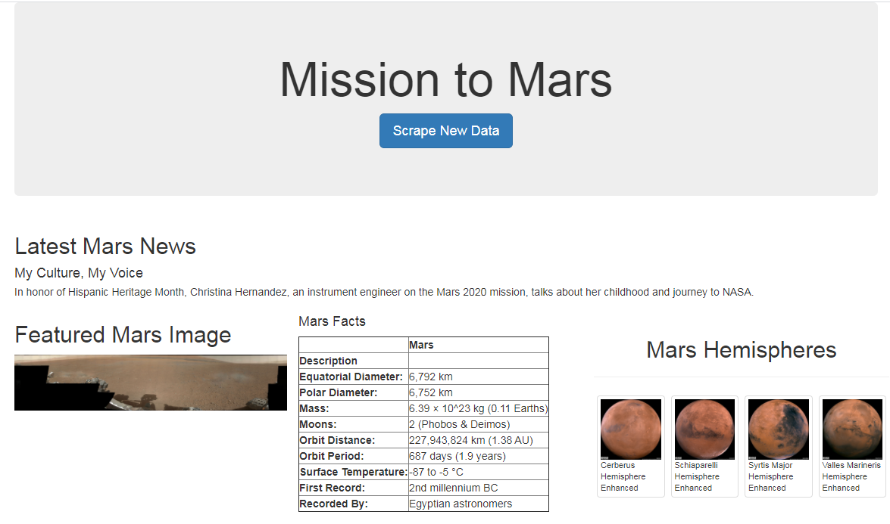
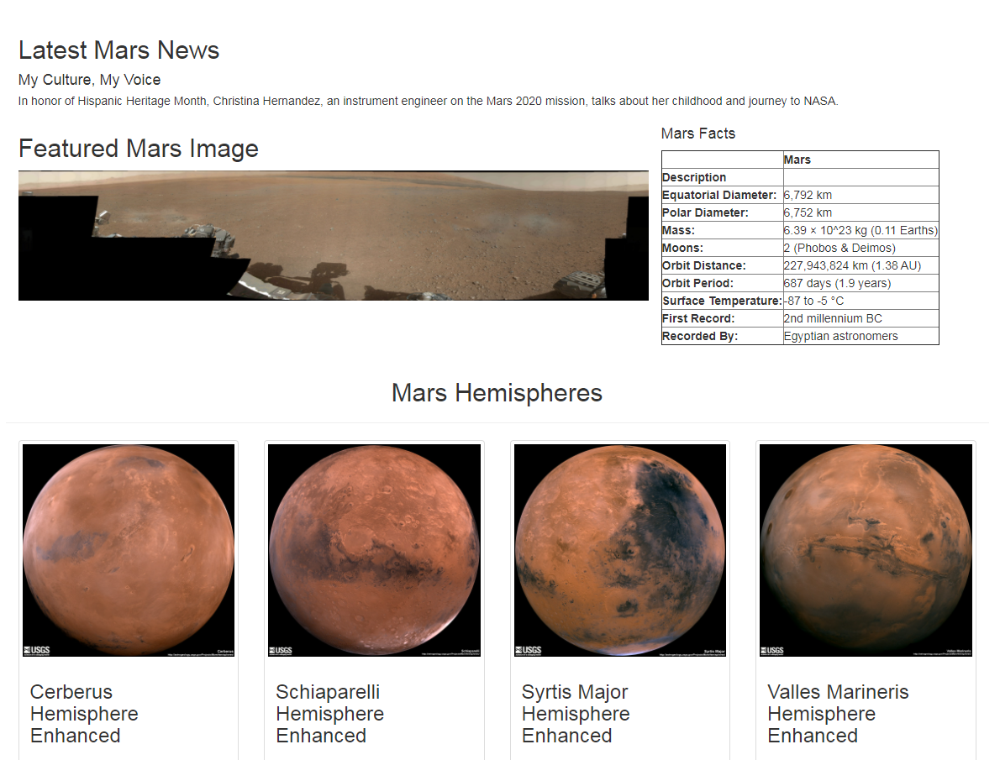
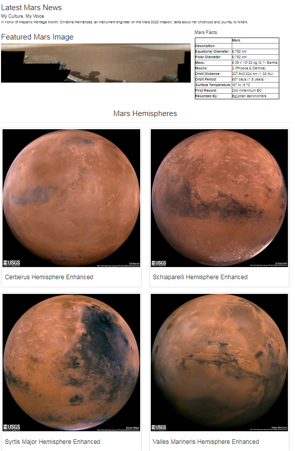
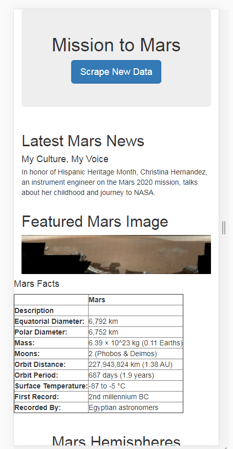
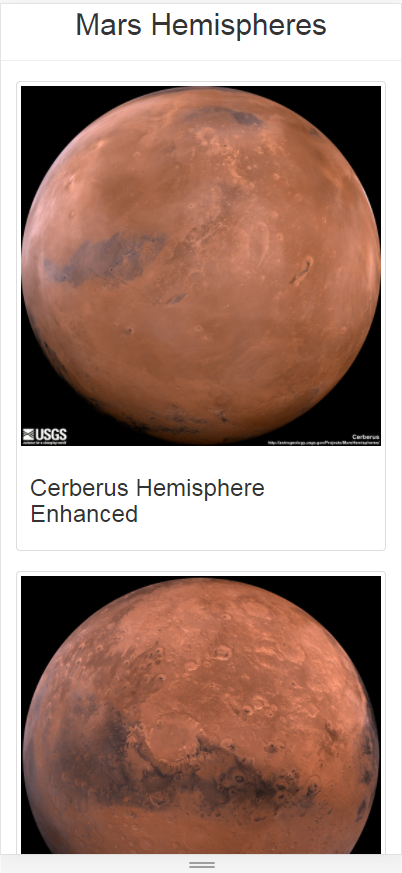
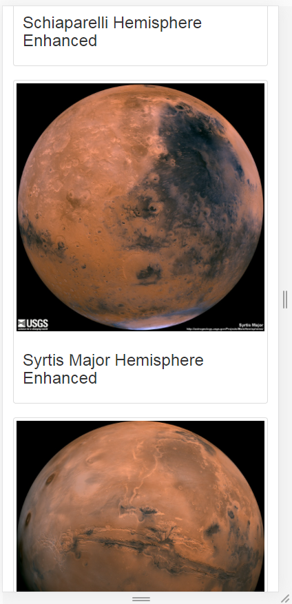
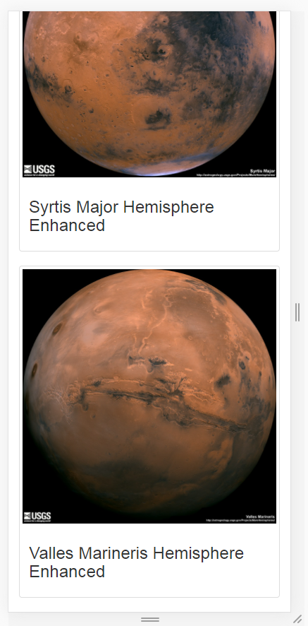

# Mission-to-Mars

## Module Project Overview

This project is for scraping web data from NASA's websites for Mars information and displaying the latest Mars news, image, facts, and hemispheres.

## Resources:
  - Data Source: 
    - https://mars.nasa.gov/news/
    - https://www.jpl.nasa.gov/spaceimages/?search=&category=Mars
    - http://space-facts.com/mars/
    - https://astrogeology.usgs.gov/search/results?q=hemisphere+enhanced&k1=target&v1=Mars
  - Software: anaconda3, python 3.7.7, jupyter notebook, mongoDB, HTML, CSS, Bootstrap 3, and chromedriver
  - Library: pandas, datetime, flask, splinter, BeautifulSoup, and PyMongo.

## Challenge Overview

Using Bootstrap 3 the webpage is displayed in different formats.

### Summary

Data stored in mondo db as follows
["Data"](./Resources/mongo_db_find.txt)

Webpage with image, facts, and hemishpheres as 3 columns of width 4 each :

  
  

Webpage with hemispheres on a row with 4 columns of width 3 each :

  
  

Webpage with hemispheres on a row with 2 columns of width 6 each :

  
  

Webpage viewed on a mobile device :

  
  
  
  
  
  
  
  
  
